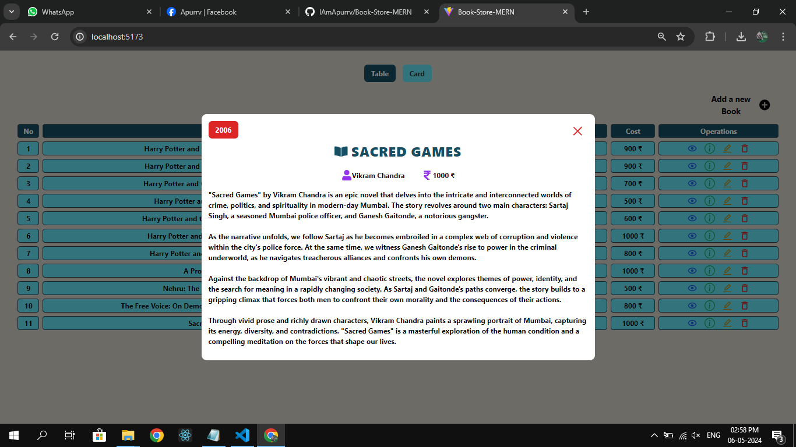
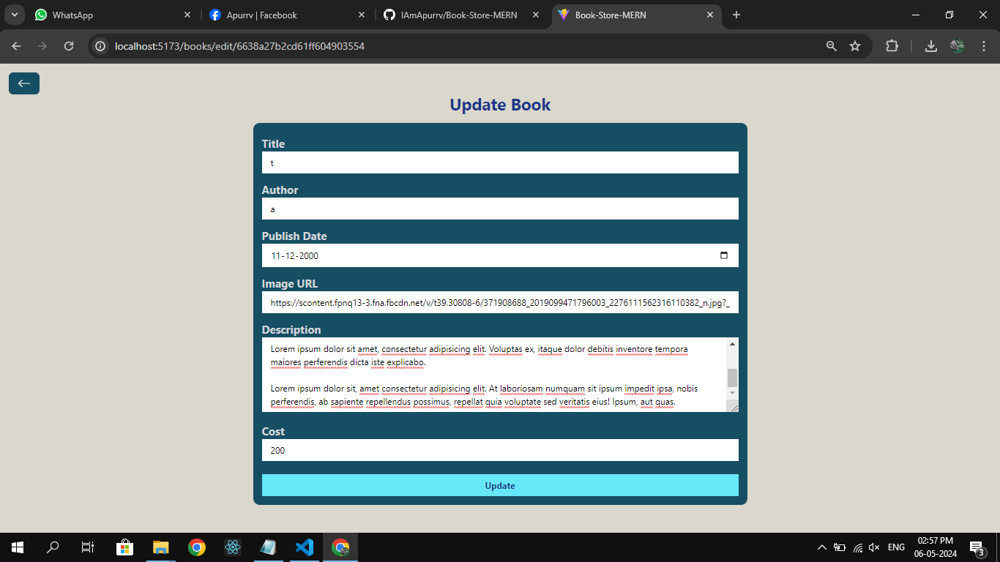

# backend -->

## cd backend
## npm init -y
## npm i express nodemon
## npm i mongoose
## npm i cors

## to run -->
  ## connect database (https://cloud.mongodb.com/v2/65d8a74b6cd3772084bc474e#/overview?connectCluster=BookStore-MERN)
  ## npm run dev

POST /books: Create a new book.
GET /books: Get all books.
GET /books/:id: Get a specific book by its ID.
PUT /books/:id: Update a book by its ID.
DELETE /books/:id: Delete a book by its ID.

{
  "title": "t1",
  "author": "a1",
  "publishYear": "2000".
  "cost": "100"
}

frontend -->

npm create vite@latest (project name --> frontend)
c frontend
npm i

https://tailwindcss.com/ --> https://tailwindcss.com/docs/guides/vite
npm install -D tailwindcss postcss autoprefixer
npx tailwindcss init -p

npm install react-router-dom axios notistack react-icons

to run --> npm run dev

