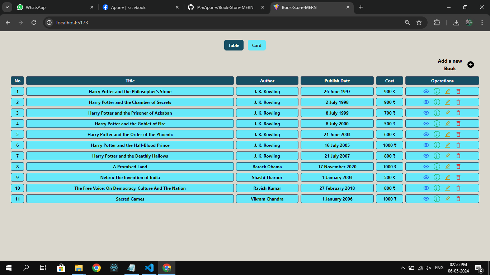
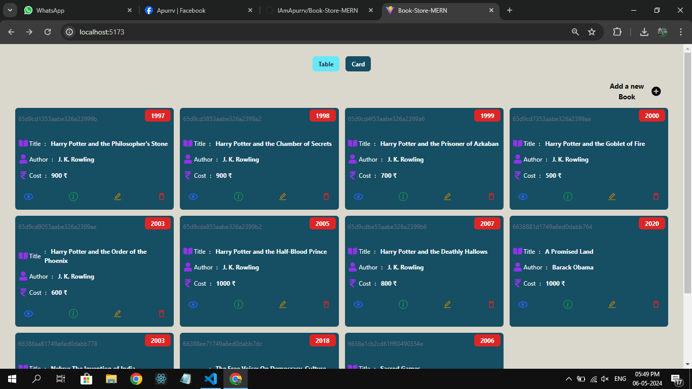
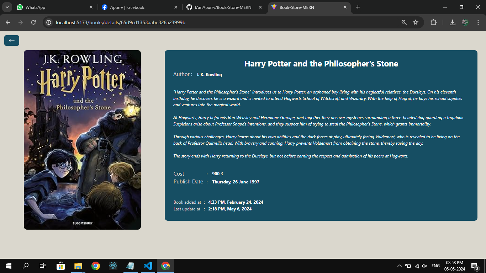
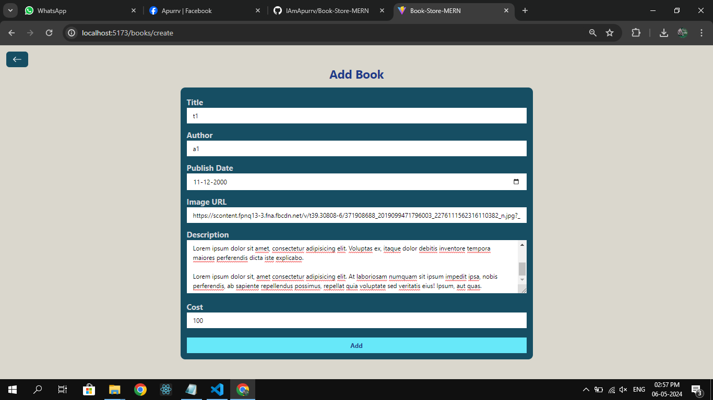

# Book-Store-MERN

This is a MERN (MongoDB, Express.js, React.js, Node.js) project for a simple book store application that performs CRUD operations.

## Running the Project

To run the Book-Store-MERN project locally, follow these steps:

### 1. Clone the Repository

```
git clone https://github.com/IAmApurrv/Book-Store-MERN.git
```

### 2. Navigate to the Backend Folder

```
cd backend
```

### 3. Install Backend Dependencies

```
npm install
```

### 4. Start the Backend Server

```
npm run dev
```

The backend server will start running on port 3000.

### 5. Open Another Terminal and Navigate to the Frontend Folder

```
cd frontend
```

### 6. Install Frontend Dependencies

```
npm install
```

### 7. Start the Frontend Server

```
npm run dev
```

The frontend server will start running on port 5173.

### 8. Access the Application

Once both servers are running, you can access the application through your web browser at http://localhost:5173.


## Screenshots

- **Table View**: 
- **Card View**: 
- **Book Model**: 
- **Show Book**: 
- **Add Book**: 
- **Edit Book**: 
- **Delete Book**: 


## Backend

The backend is built with Express.js and MongoDB Atlas online database. It handles API requests and interacts with the MongoDB database.

### Dependencies

- cors: ^2.8.5
- express: ^4.18.2
- mongodb: ^6.3.0
- mongoose: ^8.2.0
- nodemon: ^3.1.0

## Frontend

The frontend is developed using Vite React and Tailwind CSS. It provides the user interface for the book store application.

### Dependencies

- axios: ^1.6.7
- notistack: ^3.0.1
- react: ^18.2.0
- react-dom: ^18.2.0
- react-icons: ^5.0.1
- react-router-dom: ^6.22.1
